# Diagrama de Arquitectura del Sistema MLOps

## Arquitectura General

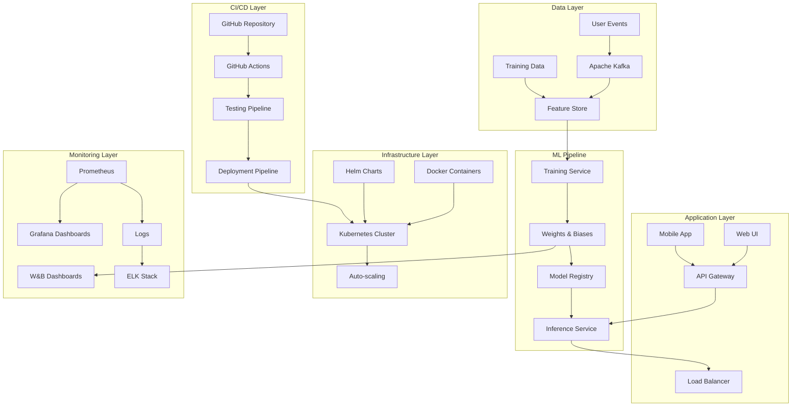

## Flujo de Datos Detallado

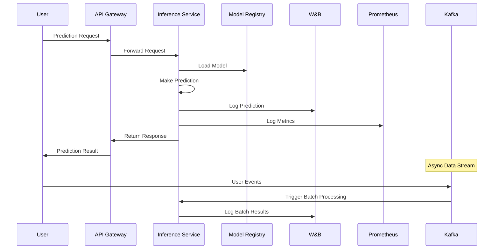

## Componentes del Sistema

### 1. Data Streaming Layer
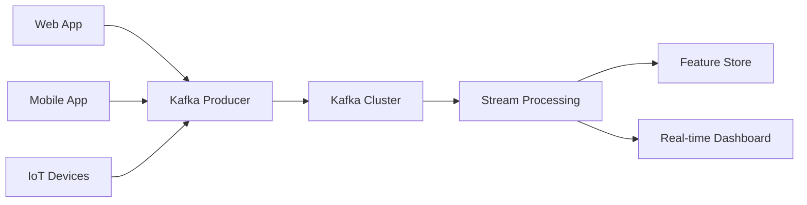

### 2. ML Training Pipeline
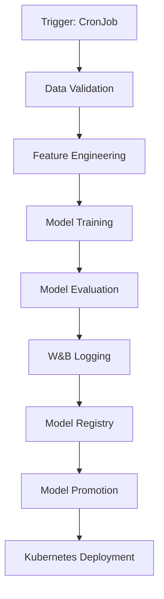

### 3. Inference Architecture
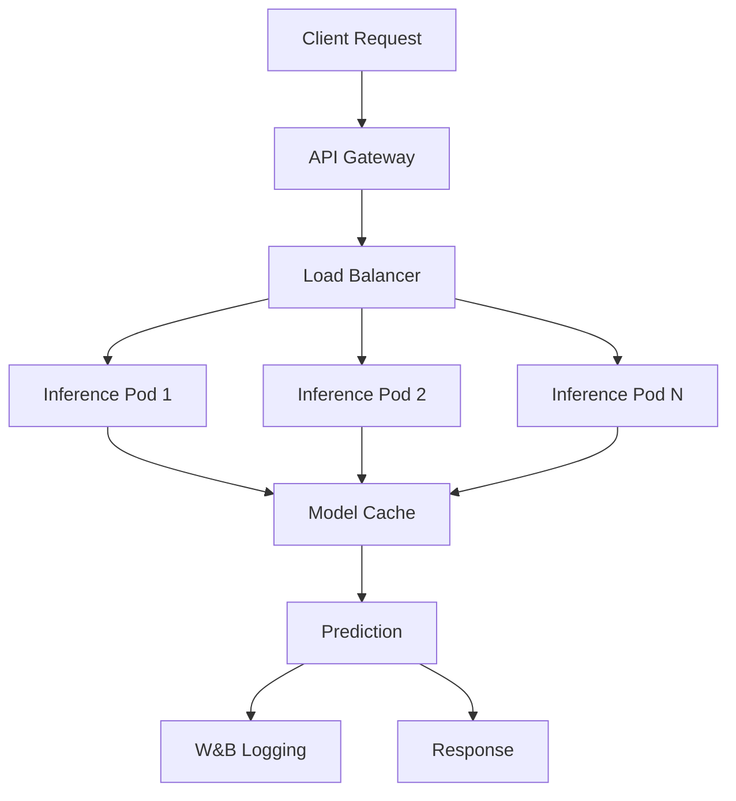

### 4. Monitoring Stack
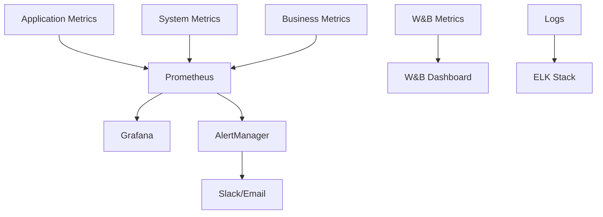

## Especificaciones Técnicas

### Kubernetes Cluster
```yaml
# Namespace Configuration
apiVersion: v1
kind: Namespace
metadata:
  name: mlip-system
  labels:
    name: mlip-system

---
# Resource Quotas
apiVersion: v1
kind: ResourceQuota
metadata:
  name: mlip-quota
  namespace: mlip-system
spec:
  hard:
    requests.cpu: "4"
    requests.memory: 8Gi
    limits.cpu: "8"
    limits.memory: 16Gi
```

### Service Mesh Architecture
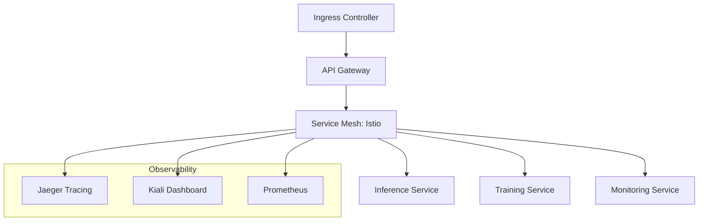

## Deployment Architecture

### Staging Environment
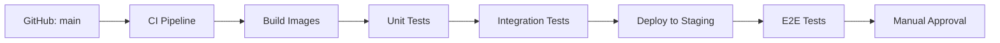

### Production Environment
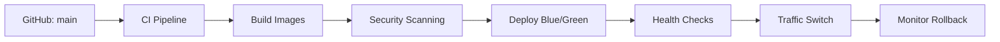

## Data Flow Architecture

### Real-time Processing
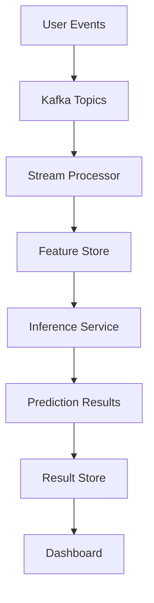

### Batch Processing
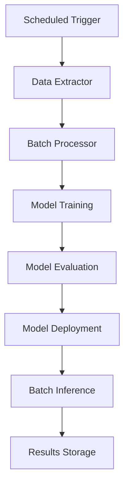

## Security Architecture

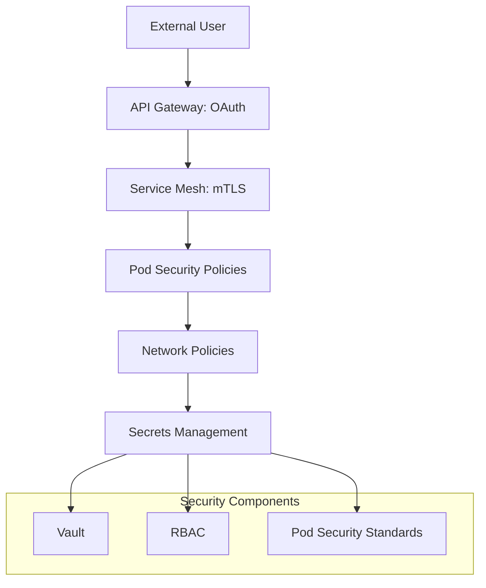

## High Availability Design

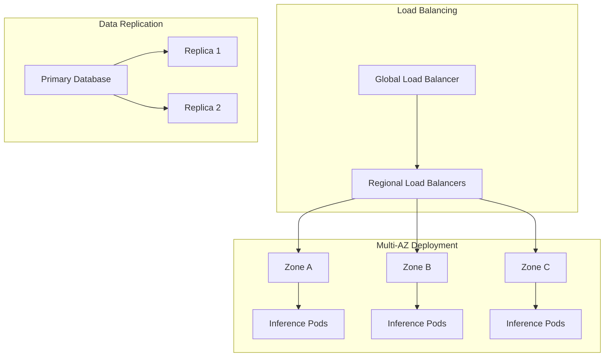

## Performance Optimization

### Caching Strategy
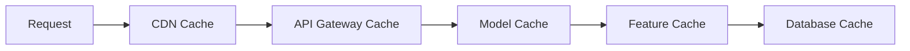

### Auto-scaling Configuration
```yaml
apiVersion: autoscaling/v2
kind: HorizontalPodAutoscaler
metadata:
  name: inference-hpa
spec:
  scaleTargetRef:
    apiVersion: apps/v1
    kind: Deployment
    name: inference-service
  minReplicas: 2
  maxReplicas: 20
  metrics:
  - type: Resource
    resource:
      name: cpu
      target:
        type: Utilization
        averageUtilization: 70
  - type: Resource
    resource:
      name: memory
      target:
        type: Utilization
        averageUtilization: 80
```

## Disaster Recovery

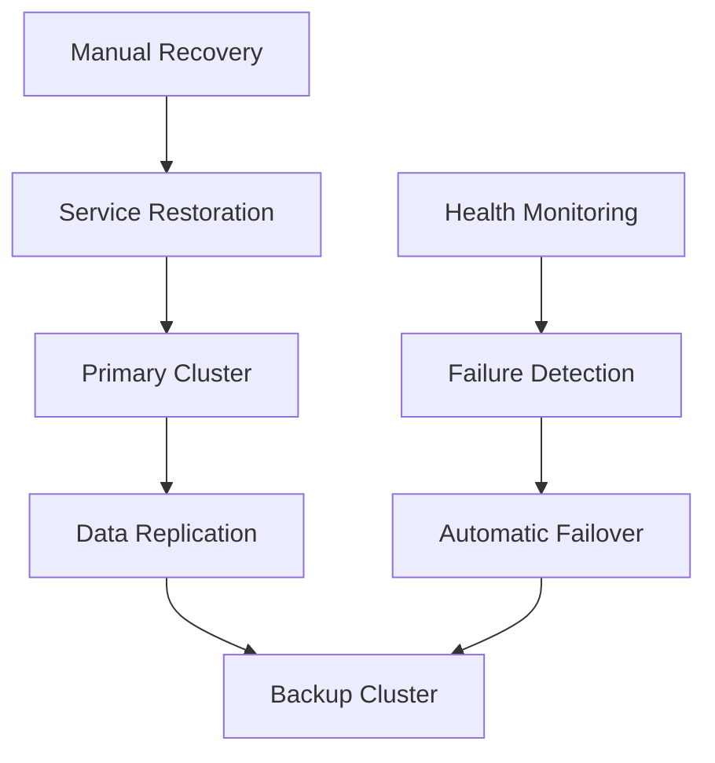

## Integration Points

### External Systems
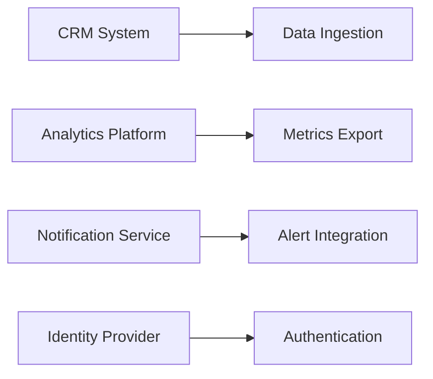

### Internal Services
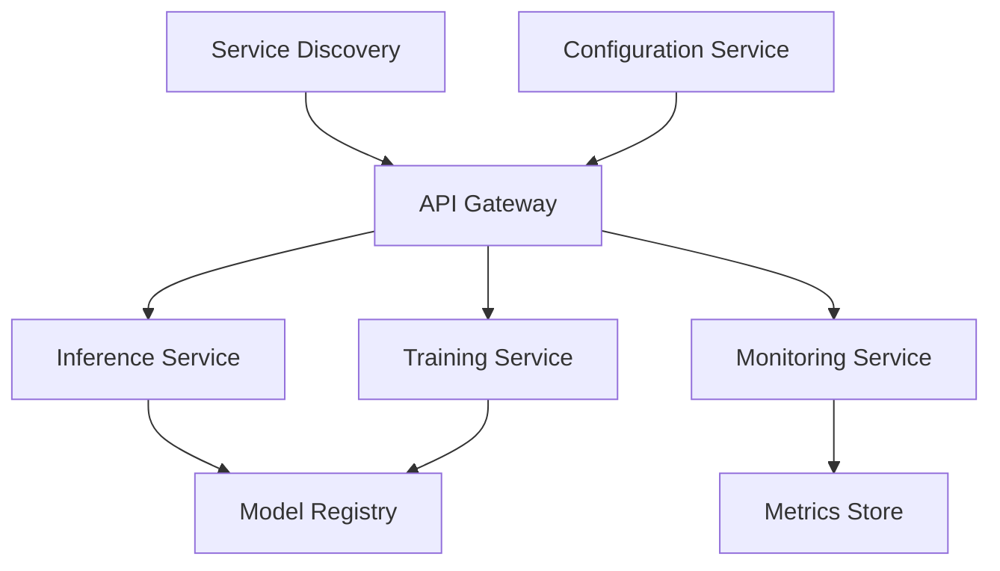
