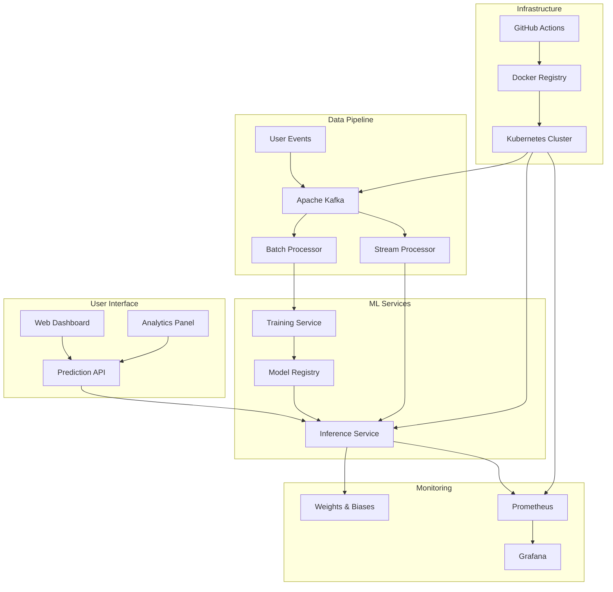

# 🚀 ML Engagement Prediction System

> A complete MLOps system for real-time user engagement prediction with full CI/CD pipeline, monitoring, and streaming capabilities.

## 🎯 Overview

This is a production-ready MLOps system that demonstrates all modern ML Engineering capabilities:

- **🤖 Machine Learning**: Training, inference, and experiment tracking
- **📊 Real-time Streaming**: Apache Kafka for data processing
- **🐳 Containerization**: Docker with multi-stage builds
- **☸️ Orchestration**: Kubernetes with auto-scaling
- **📈 Monitoring**: Prometheus + Grafana + Weights & Biases
- **🔄 CI/CD**: GitHub Actions with automated deployments
- **🌐 Web Interface**: Modern dashboard for predictions and analytics

## 🏗️ System Architecture



## ✨ Key Features

### 🎯 ML Capabilities
- **Automated Training**: Scheduled model training with hyperparameter optimization
- **Real-time Inference**: Sub-100ms prediction latency with load balancing
- **Experiment Tracking**: Complete W&B integration with metrics, artifacts, and versioning
- **Model Monitoring**: Drift detection and performance tracking
- **A/B Testing**: Built-in support for model comparison

### 📊 Streaming & Processing
- **Apache Kafka**: Real-time event streaming with multiple topics
- **Stream Processing**: Real-time feature engineering and predictions
- **Batch Processing**: Scheduled model retraining with accumulated data
- **Backpressure Handling**: Graceful degradation under high load

### 🐳 Container & Orchestration
- **Multi-stage Docker Builds**: Optimized images for production
- **Kubernetes**: Complete orchestration with StatefulSets and Deployments
- **Auto-scaling**: HPA based on CPU, memory, and custom metrics
- **Rolling Updates**: Zero-downtime deployments with rollback capability

### 📈 Monitoring & Observability
- **Prometheus**: System and application metrics collection
- **Grafana**: Pre-built dashboards for ML and system metrics
- **Weights & Biases**: ML experiment tracking and visualization
- **Distributed Tracing**: Request tracking across microservices
- **Health Checks**: Comprehensive service health monitoring

### 🔄 CI/CD Pipeline
- **Automated Testing**: Unit, integration, and performance tests
- **Security Scanning**: Vulnerability scanning and code analysis
- **Multi-environment**: Staging and production deployments
- **GitOps**: Infrastructure as code with automated rollouts

## 🚀 Quick Start

### Prerequisites
- Docker >= 20.10.0
- Kubernetes >= 1.24.0
- Python >= 3.9
- W&B Account
- Docker Hub Account

### 1. Clone and Setup
```bash
git clone https://github.com/your-org/mlip-engagement-prediction.git
cd mlip-engagement-prediction

# Setup environment
cp .env.example .env
# Edit .env with your credentials
```

### 2. Local Development
```bash
# Start all services locally
docker-compose -f docker-compose.kafka.yaml up -d

# Access services
# Web UI: http://localhost:5000
# Grafana: http://localhost:3000 (admin/admin)
# Prometheus: http://localhost:9090
# Kafka UI: http://localhost:8080
```

### 3. Test the System
```bash
# Make a prediction
curl -X POST http://localhost:5001/predict \
  -H "Content-Type: application/json" \
  -d '{
    "user_id": "test_user",
    "avg_session_duration": 25.5,
    "visits_per_week": 8,
    "response_rate": 75.0,
    "feature_usage_depth": 6
  }'

# Run integration tests
python tests/integration_test.py \
  --web-ui-url http://localhost:5000 \
  --inference-url http://localhost:5001
```

### 4. Kubernetes Deployment
```bash
# Deploy to Kubernetes
kubectl apply -f k8s/

# Check status
kubectl get pods -n mlip-system
kubectl get services -n mlip-system
```

## 📁 Project Structure

```
mlip-engagement-prediction/
├── 📁 mlip-kubernetes-lab/           # Core ML services
│   ├── 🐳 Dockerfile.*              # Container configurations
│   ├── 🐍 *.py                      # Python services
│   ├── 📁 app/                      # Flask web application
│   ├── 📁 templates/                # HTML templates
│   ├── 📁 k8s/                      # Kubernetes configurations
│   ├── 📁 monitoring/               # Prometheus/Grafana configs
│   └── 📁 tests/                    # Test suites
├── 📁 mlip-lab-monitoring/          # System monitoring
│   ├── 📄 docker-compose.yaml       # Monitoring stack
│   └── 📄 *.py                      # Monitoring scripts
├── 📁 .github/workflows/            # CI/CD pipelines
├── 📄 SYSTEM_REQUIREMENTS.md        # System specifications
├── 📄 ARCHITECTURE_DIAGRAM.md       # Architecture documentation
├── 📄 DEPLOYMENT_GUIDE.md           # Complete deployment guide
└── 📄 README_WANDB.md              # W&B integration guide
```

## 🎮 Usage Examples

### Making Predictions
```python
import requests

# Single prediction
response = requests.post('http://localhost:5001/predict', json={
    'user_id': 'user_123',
    'avg_session_duration': 30.0,
    'visits_per_week': 10,
    'response_rate': 85.0,
    'feature_usage_depth': 7
})

prediction = response.json()
print(f"Engagement Score: {prediction['engagement_score']}")
```

### Streaming Events
```python
from kafka_integration import KafkaMLIntegration

# Initialize Kafka integration
kafka_ml = KafkaMLIntegration()

# Send user events
kafka_ml.produce_user_event('user_123', {
    'event_type': 'session_start',
    'session_duration': 25.5,
    'visits_per_week': 8,
    'response_rate': 75.0,
    'feature_usage_depth': 6
})
```

### Model Training
```python
from model_trainer import train_model

# Train new model
success = train_model()
if success:
    print("Model trained successfully!")
```

## 📊 Monitoring Dashboards

### Grafana Dashboards
- **System Overview**: CPU, Memory, Network metrics
- **ML Performance**: Model accuracy, latency, prediction volume
- **Kafka Monitoring**: Message throughput, consumer lag
- **Business Metrics**: User engagement trends

### W&B Dashboards
- **Experiment Tracking**: Training runs, hyperparameters
- **Model Performance**: Metrics over time, comparison charts
- **Data Analysis**: Feature importance, data distributions
- **Production Monitoring**: Real-time predictions, drift detection

## 🔧 Configuration

### Environment Variables
```bash
# W&B Configuration
WANDB_API_KEY=your_wandb_api_key
WANDB_PROJECT=mlip-engagement-prediction

# Kafka Configuration
KAFKA_BOOTSTRAP_SERVERS=localhost:9092

# Service URLs
INFERENCE_SERVICE_URL=http://localhost:5001
WEB_UI_URL=http://localhost:5000

# Monitoring
PROMETHEUS_URL=http://localhost:9090
GRAFANA_URL=http://localhost:3000
```

### Kubernetes Configuration
```yaml
# k8s/configmap.yaml
apiVersion: v1
kind: ConfigMap
metadata:
  name: mlip-config
data:
  WANDB_PROJECT: "mlip-engagement-prediction"
  KAFKA_BOOTSTRAP_SERVERS: "kafka-service:9092"
  MODEL_RELOAD_INTERVAL: "30"
```

## 🧪 Testing

### Unit Tests
```bash
pytest tests/unit/ -v --cov=. --cov-report=html
```

### Integration Tests
```bash
pytest tests/integration/ -v
```

### Performance Tests
```bash
k6 run tests/performance_test.js
```

### End-to-End Tests
```bash
python tests/e2e_test.py --environment staging
```

## 📈 Performance Metrics

### System Performance
- **Prediction Latency**: < 100ms (P95)
- **Throughput**: > 1000 predictions/second
- **Availability**: 99.9% uptime
- **Scalability**: Horizontal scaling to 10x load

### Model Performance
- **Accuracy**: > 85% on validation set
- **Precision**: > 80% for high engagement users
- **Recall**: > 75% for at-risk users
- **F1-Score**: > 0.78 overall

## 🛡️ Security

### Authentication & Authorization
- OAuth2 integration
- API key management
- Role-based access control
- JWT token validation

### Data Protection
- Encryption in transit (TLS)
- Encryption at rest
- Secrets management with Kubernetes
- GDPR compliance considerations

### Security Scanning
- Container vulnerability scanning
- Dependency security checks
- Code security analysis
- Penetration testing

## 🔄 CI/CD Pipeline

### Pipeline Stages
1. **Code Quality**: Linting, formatting, type checking
2. **Testing**: Unit, integration, performance tests
3. **Security**: Vulnerability scanning, code analysis
4. **Build**: Multi-platform Docker images
5. **Deploy**: Staging environment with integration tests
6. **Production**: Automated deployment with rollback

### GitHub Actions
- **Triggers**: Push to main/develop, pull requests, scheduled
- **Environments**: Development, staging, production
- **Secrets Management**: Encrypted secrets and tokens
- **Notifications**: Slack integration for deployment status

## 📚 Documentation

- [System Requirements](SYSTEM_REQUIREMENTS.md)
- [Architecture Diagram](ARCHITECTURE_DIAGRAM.md)
- [Deployment Guide](DEPLOYMENT_GUIDE.md)
- [W&B Integration](README_WANDB.md)
- [API Documentation](docs/api.md)
- [Troubleshooting Guide](docs/troubleshooting.md)

## 🤝 Contributing

1. Fork the repository
2. Create a feature branch (`git checkout -b feature/amazing-feature`)
3. Commit your changes (`git commit -m 'Add amazing feature'`)
4. Push to the branch (`git push origin feature/amazing-feature`)
5. Open a Pull Request

### Development Guidelines
- Follow PEP 8 style guidelines
- Write comprehensive tests
- Update documentation
- Use semantic versioning
- Sign commits with GPG

## 📄 License

This project is licensed under the MIT License - see the [LICENSE](LICENSE) file for details.

## 🙏 Acknowledgments

- [Weights & Biases](https://wandb.ai/) for experiment tracking
- [Apache Kafka](https://kafka.apache.org/) for streaming
- [Prometheus](https://prometheus.io/) for monitoring
- [Kubernetes](https://kubernetes.io/) for orchestration
- [Flask](https://flask.palletsprojects.com/) for web framework

## 📞 Support

- 📧 Email: ml-team@yourcompany.com
- 💬 Slack: #mlip-system
- 📖 Documentation: [docs/](docs/)
- 🐛 Issues: [GitHub Issues](https://github.com/your-org/mlip-engagement-prediction/issues)

---

## 🎉 Success Metrics

Your deployment is successful when:

- ✅ All services are healthy and responding
- ✅ Predictions are being made in real-time
- ✅ Kafka is processing events without lag
- ✅ Monitoring dashboards show live data
- ✅ W&B is tracking experiments
- ✅ CI/CD pipeline is running automatically
- ✅ Auto-scaling responds to load changes
- ✅ Security scans pass
- ✅ Integration tests pass
- ✅ Users can access the web interface

**Ready to production! 🚀**
